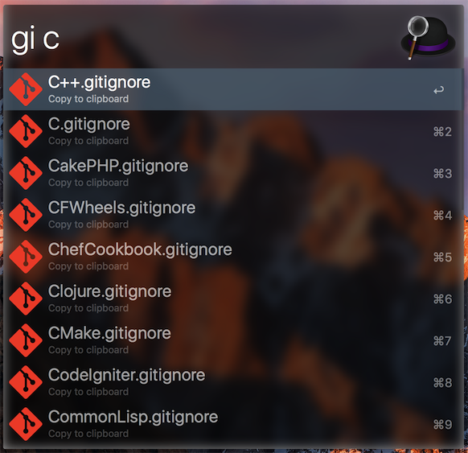
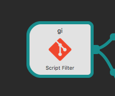
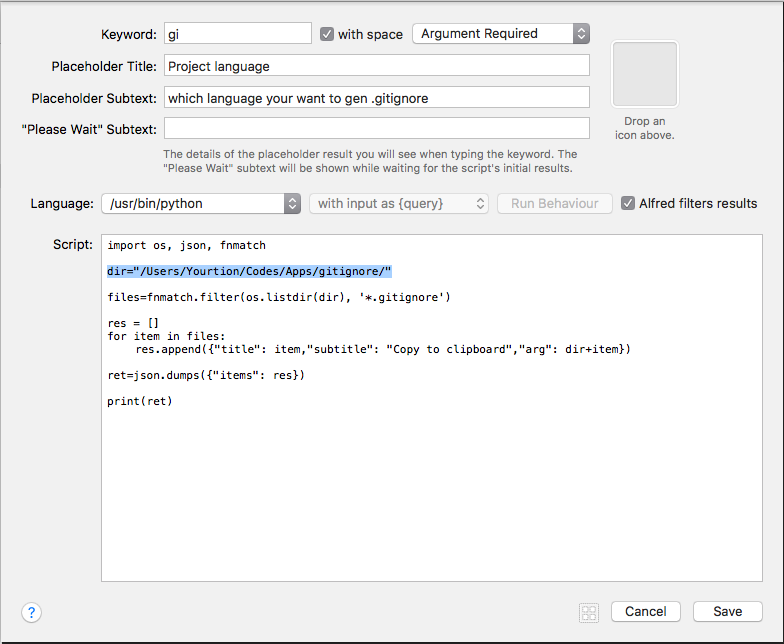

# Alfred_Gitignore

Easy get git ignore (base on [GitHub gitignore](https://github.com/github/gitignore)) from Alfred workflow

快速生成 gitignore 到剪切板（基于  [GitHub gitignore](https://github.com/github/gitignore) ）

## ScreenShot

## Config gitignore repo path

Double click to set.

My path is `/Users/Yourtion/Codes/Apps/gitignore/` 

